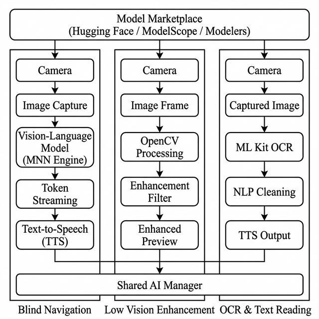
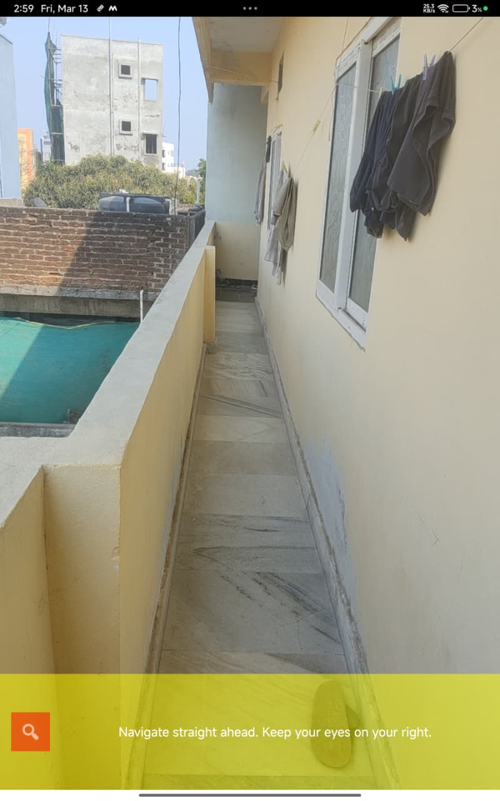
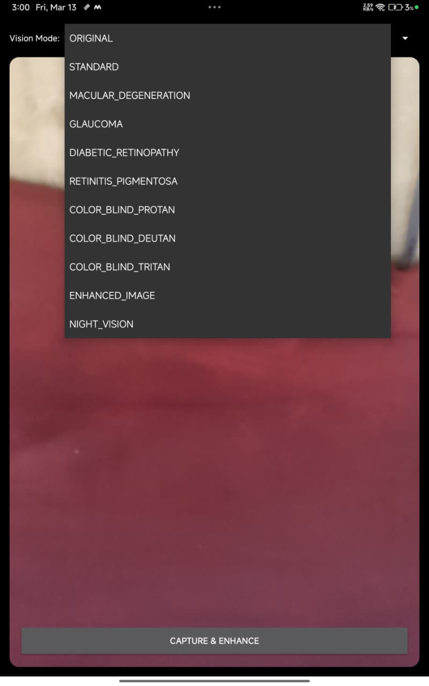
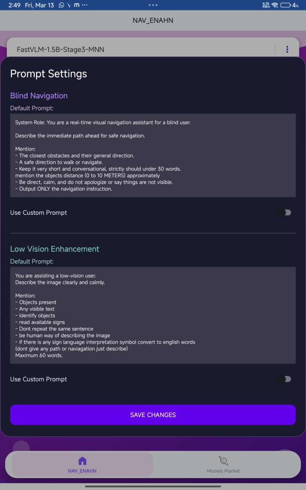
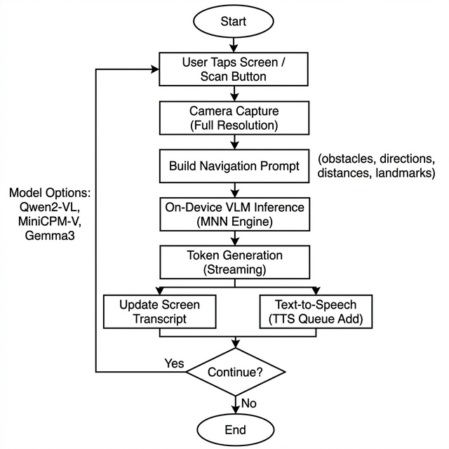
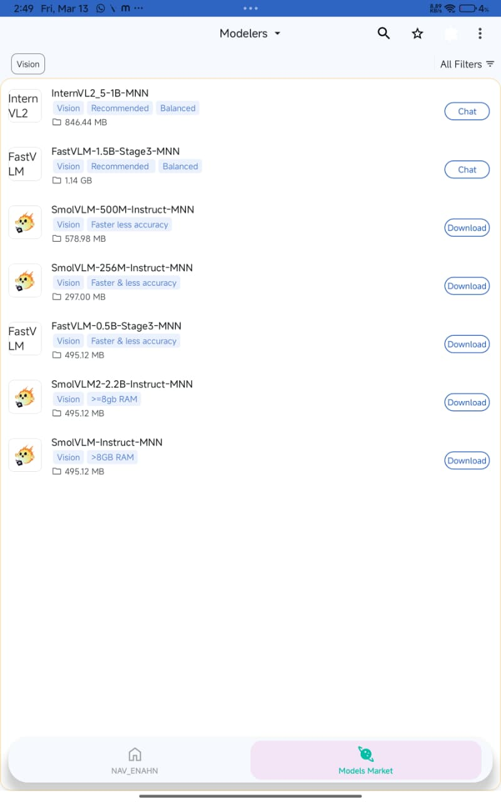

# VISIONAid++ 👁️🚀

### *Empowering the Visually Impaired with On-Device Intelligence*

VISIONAid++ is a cutting-edge Android application designed to provide **real-time blind navigation** and **low-vision enhancement**. By leveraging the high-performance **MNN (Mobile Neural Network)** engine, the app delivers sophisticated AI capabilities entirely on-device, ensuring maximum privacy and ultra-low latency.



---

## 🌟 Core Features

### 🗺️ 1. Blind Navigation (Real-Time Visual Assistant)
Navigate your environment with confidence. Using advanced Vision-Language Models (VLM), the app analyzes the camera feed to provide immediate, safe, and conversational navigation instructions via **Text-to-Speech (TTS)**.

*   **Obstacle Detection**: Identifies nearby objects and their directions.
*   **Distance Estimation**: Detects objects within a 0 to 10-meter range.
*   **Safe Pathfinding**: Directly guides you on where to walk.



*Sample Prompt Logic applied to Navigation:*
> "Navigate straight ahead. Keep your eyes on your right."

---

### 🔍 2. Low Vision Enhancement Suite
A comprehensive set of digital filters and enhancement tools designed to assist users with various visual impairments.



*   **Ophthalmic Filters**: specialized modes for **Glaucoma**, **Macular Degeneration**, **Diabetic Retinopathy**, and **Retinitis Pigmentosa**.
*   **Color Blindness Support**: Optimized palettes for **Protanopia**, **Deuteranopia**, and **Tritanopia**.
*   **Enhanced Visibility**: **Night Vision** and **High Contrast** modes for difficult lighting conditions.
*   **Dynamic Magnification**: Real-time zoom and enhancement.

---

### 📄 3. OCR & Text Intelligence
Instantly convert physical text into spoken words.
*   **Seamless OCR**: Powered by Google ML Kit for high-speed text recognition.
*   **NLP Cleaning**: Refines captured text for natural-sounding speech output.
*   **Multi-Sign Support**: Reads available signs and identifies objects in the scene.

---

## 🧠 Intelligence Customization

VISIONAid++ allows users and developers to fine-tune the AI's "brain" through **Custom Prompt Settings**. This allows for highly specialized navigation or description logic tailored to individual needs.



### 🛰️ Navigation System Role
```text
System Role: You are a real-time visual navigation assistant for a blind user.
Describe the immediate path ahead for safe navigation.
Mention:
- The closest obstacles and their general direction.
- A safe direction to walk or navigate.
- Be direct, calm, and conversational (under 30 words).
- Output ONLY the navigation instruction.
```

### 🏞️ Vision Analysis Prompt
```text
Description: Describe the image clearly and calmly for a low-vision user.
Mention:
- Objects present, identifying and reading available signs.
- Human-like description, avoiding apologies or repetitions.
- Sign language interpretation (if present) into English.
- Maximum 60 words.
```

---

## 🏗️ Technical Architecture

VISIONAid++ represents a breakthrough in on-device AI for accessibility.



*   **MNN Engine**: Powered by Alibaba's MNN for state-of-the-art inference on mobile ARM/Vulkan architectures.
*   **OpenCV Processing**: Real-time image processing for low-vision filters.
*   **Sherpa-MNN Integration**: High-fidelity Text-to-Speech (TTS) for natural voice feedback.
*   **Model Marketplace**: Direct integration with **HuggingFace**, **ModelScope**, and **Modelers** for downloading the latest optimized VLMs.



---

## 🎓 Research & Publications

The technical foundations and experimental evaluations of **VISIONAid++** are detailed in our comprehensive technical brief. This research explores the integration of parallel computer vision and LLM pipelines optimized for mobile accessibility.

### **[VisionAid++: Empowering the Visually Impaired with On-Device Intelligence]**
*Authors: Raju Bandam, et al.*

**Key Contributions:**
*   **Parallel Pipeline Architecture**: Simultaneous management of Navigation, Low Vision Enhancement, and OCR modules.
*   **Dynamic Prompt Engineering**: Specialized system roles for high-accuracy assistive interaction.
*   **Experimental Evaluation**: In-depth analysis of inference latency and enhancement quality on mobile hardware.

📄 **[Download the Technical Brief (PDF)](./brief.pdf)**

---

## 📦 Getting Started

### Prerequisites
*   Android device (Qualcomm Snapdragon 8 Gen 1+ recommended for VLM).
*   Storage space for on-device models.

### Installation
1.  Clone the repository.
2.  Open in Android Studio.
3.  Build and install the APK.
4.  Launch and visit the **Model Market** to download a Vision-Language Model (e.g., `FastVLM-1.5B`).

---

## 🛡️ Privacy & Performance
All processing happens **on-device**. No camera data is sent to the cloud, ensuring total user privacy. The app is optimized for high-speed token streaming and minimal battery consumption.

*Note: This application currently supports only Text-to-Speech (TTS) for audio output. ASR functionality is not implemented.*

---

## 📜 License & Usage

> [!CAUTION]
> **Copyright Notice**: This project is for educational and accessibility research purposes. **Unauthorized copying, redistribution, or illegal use of this software is strictly prohibited.**

If you use this project or any part of its source code in your own work, please **give proper credit** to the original developer. 

---

*Built with passion for accessibility and AI innovation by **Raju Bandam**.*
